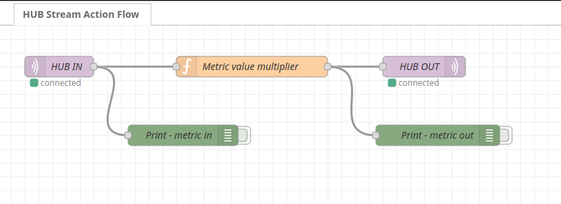

HUB Action using stream with Node-RED
=====================================

Demo of Node-RED doing stream processing with HUB Action Stream MQTT.



## Run

_If not already running, start a local HUB MQTT Broker_

```sh 
docker run --rm -ti -p 1883:1883 ghcr.io/hubsystem/hub-edge-mqtt:master
```

```sh
./test-action.sh
```

You can then browse `http://localhost:1880` to access Node-RED Desktop.

Send test metrics as MQTT event using HUB `csv-to-mqtt` util

```sh
csv-to-mqtt events.csv
```
